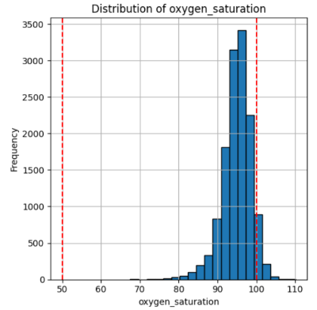
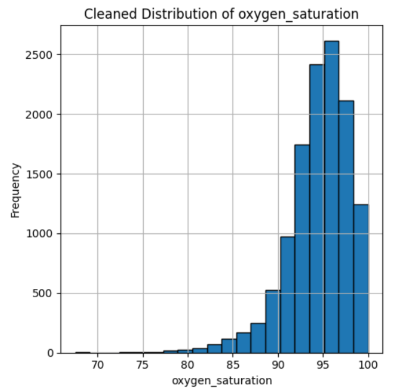
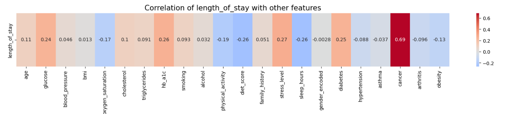
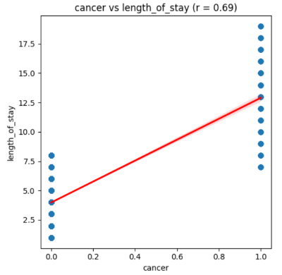
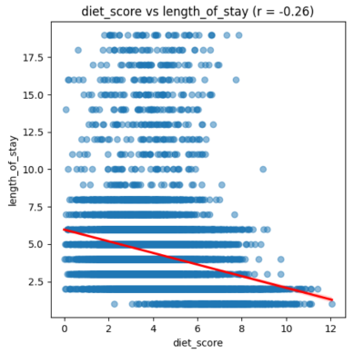
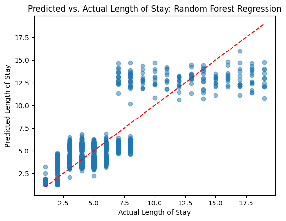
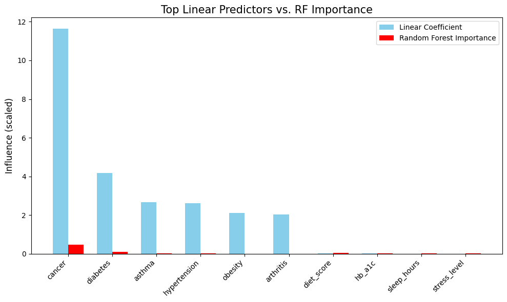
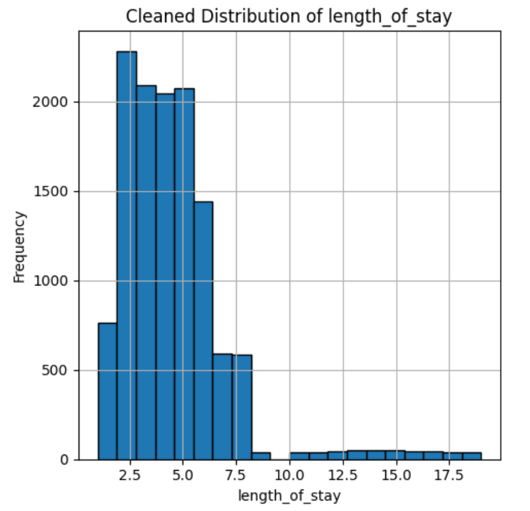

# Using Healthcare Risk Factors to Predict Length of Hospital Stay


### Data manipulation and analysis on a synthetic hospital record data set

This project explores how medical risk factors can be analyzed to predict the length of hospital stay. It demonstrates end-to-end data science practices, including cleaning noisy data, visualizing trends, and comparing linear vs. nonlinear regression nethods for predictive accuracy.

While patient vitals are often highly variable, the ability to predict how long they will stay after initial admittance can aid in hospital resource planning and allocation, as well as alert to high-risk indicators that may signal a longer duration of hospitalization.

## Project Goals

- Clean and validate synthetic patient records with noisy columns, null values, and implausible entries
- Visualize medical vitals/conditions against hospital stay length
- Build and evaluate linear and nonlinear regression models
- Compare model performance and determine feature performance

## Executive Summary
Linear regression acheived the strongest performance (adjusted R<sup>2</sup> = 0.66, $\pm$ 1.25 days error), drawing predictive power primarily from medical conditions. Random Forest performed slightly worse (adjusted R<sup>2</sup> = 0.65, $\pm$ 1.27 days error), but emphasized patient vitals. Together, these results suggest that in this hospital, medical conditions provided clearer predictive signals for hospital stay, while vitals contributed complementary but less consistent information.

## Repository Contents

* `hospital_stay_prediction.ipynb` &rarr; Jupyter notebook with full Python workflow
* `images/` &rarr; folder with `.png` files of all visual outputs
* `patient_records.csv` &rarr; original Kaggle dataset, renamed for simplicity purposes
* `requirements.txt` &rarr; Python dependencies used for the project

## Viewing and running the project
1. **Clone the repository**
```bash
git clone https://github.com/skadamcik/hospital-stay-prediction.git
cd hospital-stay-prediction
```
2. **Create a virtual environment (recommended)**
```bash
python -m venv venv
source venv/bin/activate # On Mac/Linux
venv\Scripts\activate # On Windows
```
3. **Install dependencies**
```bash
pip install -r requirements.txt
```
4. **Run the Jupyter notebook**
```bash
jupyter notebook hospital_stay_prediction.ipynb
```
5. **Explore results**
* The notebook walks through data cleaning, exploratory analysis, and model development.
* Visualizations and outputs are saved as .png files in the project folder for quick reference.

## Dataset Description

The original synthetic dataset can be found [on Kaggle](https://www.kaggle.com/datasets/abdallaahmed77/healthcare-risk-factors-dataset/data), and includes 30,000 unique records with 20 features.

| Feature Name      | Short Description                                            | Data Type |
| :---------------- | :----------------------------------------------------------- | :-------- |
| `Age`               | Patient's age in years                                       | `float`     |
| `Gender`            | Male or Female                                               | `object`    |
| `Medical Condition` | Reported health condition (Healthy, Arthritis, Cancer, etc.) | `object`    |
| `Glucose`           | Blood glucose level (mg/dL)                                  | `float`     |
| `Blood Pressure`    | Systolic blood pressure                                      | `float`     |
| `BMI`               | Body Mass Index                                              | `float`     |
| `Oxygen Saturation` | Blood oxygen saturation level (%)                            | `float`     |
| `LengthOfStay`      | Number of days spent in hospital                             | `int`       |
| `Cholesterol`       | Cholesterol level (mg/dL)                                    | `float`     |
| `Triglycerides`     | Triglyceride level (mg/dL)                                   | `float`     |
| `HbA1c`             | Hemoglobin A1c (%)                                           | `float`     |
| `Smoking`           | Whether the patient smokes (0 = non-smoker, 1 = smoker)      | `int`       |
| `Alcohol`           | Whether the patient consumes alcohol (0 = no, 1 = yes)       | `int`       |
| `Physical Activity` | Hours/week of physical activity                              | `float`     |
| `Diet score`        | Quality of diet (numeric)                                    | `float`     |
| `Family History`    | Family medical history (0 = no, 1 = yes)                     | `int`       |
| `Sleep Hours`       | Average hours of sleep per day                               | `float`     |
| `random_notes`      | Various random strings                                       | `object`    |
| `noise_col`         | Unrelated, random values                                     | `float`     |

## Workflow Overview

### Part 1: Libraries Used

- pandas (data manipulation)
- numpy (numerical operations)
- matplotlib, seaborn (data visualizations)
- scikit-learn (model development):
  - `LinearRegression`, `Ridge`, `Lasso`
  - `RandomForestRegressor`
  - `train_test_split`,  accuracy metrics (e.g. `r2_score`, `mean_absolute_error`, `root_mean_squared_error`)
- statsmodels (diagnostics):
  - `variable_inflation_factor`
  - `add_constant`

### Part 2: Data Cleaning
Several measures were taken to prime the dataset for regression analysis.
1. Dropped unrelated columns (e.g. `random_notes`, `noise_col`)

2. Removed records with any number of missing values. Without medical expertise, attempting to impute values risked introducing bias. Given the size of the dataset, regression models could still generalize well.

3. Standardized feature names (e.g. `Medical Condition` &rarr; `medical_condition`)

4. Established a validation dictionary with plausible ranges for vitals (see **References** section for sources, also linked in notebook). Overlayed validation boundaries on histograms and dropped records outside these ranges.
    * Ex. Oxygen Saturation



5. Encoded categorical features:
    * `gender`: binary encoding &rarr; `gender_encoded`
    * `medical_condition`: one-hot encoding (baseline = "Healthy"), then converted from `boolean` to `int`

**Final dataset:** 12,341 entries, 23 columns

### Part 3: Exploratory Data Analysis
To assess relationships between features, an initial correlation heatmap was generated in the notebook. This highlighted potential sources of multicollinearity. For example, `diabetes`, `glucose`, and `hb_a1c` showed strong, positive correlations with each other, while `age` and `oxygen_saturation` had moderate negative correlations with `asthma`.

A second heatmap was generated with `length_of_stay` as the target focus.



**Key findings:**
* **`cancer` was most strongly correlated with `length_of_stay`**
* Moderate correlations shown for `hb_a1c`, `diet_score`, `stress_level`, `sleep_score`, and `diabetes`

Further exploring these relationships, scatterplots were generated for each feature against `length_of_stay`, with trendlines added for clarity.
* Ex. `cancer` (`r = 0.69`) and `stress_level` (`r = -0.26`) against `length_of_stay`




**Feature selection:**
* Dropped features with correlation magnitude < 0.1
* Retained medical condition features to preserve one-hot encoding integrity
* Although best practice suggests dropping features with |r| < 0.25, borderline features (`glucose`) and others with potential real-world significance (`age`, `oxygen_saturation`, `physical_activity`) were kept

**Regression dataset:** 12,341 records, 15 features

### Part 4: Linear Regression model development and evaluation
Using the refined dataset and a 70/30 training/testing split, a baseline linear regression model acheived an **adjusted R<sup>2</sup> of 0.66**, with an average prediction error of **$\pm$ 1.25 days**. As expected, the model performed better with shorter lengths of stay, but variability increased for longer stays. Residual analysis (not shown here) confirmed this, highlighting greater error at higher lengths of stay.


**Key findings:**
* Medical conditions were stronger predictors of hospital stay than vital metrics, (due to binary encoding). 
* Compared to a healthy patient:
    * Cancer patients stay almost **12 days longer**
    * Diabetes patients stay about **4 days longer**
    * Asthma and hypertension patients stay almost **3 days longer**
    * Obesity and arthritis patients stay about **2 days longer**

To assess multicollinearity, the variable inflation factor (VIF) was calculated. Only `diabetes` exceeded 10 (10.81), while `hypertension` and `obesity` had borderline-high values (6.22 and 4.90). These features were maintained to preserve one-hot integrity.

Ridge and Lasso regression models were tuned and tested. 
* Ridge regression ($\alpha$ = 0.01) performed identically to the baseline linear model
* Lasso regression ($\alpha$ = 0.001) performed marginally better, but not enough to justify replacing the initial linear model. 

### Part 5: Random Forest regression model development and evaluation
To address the limited variation in predictions from the linear model, a Random Forest regression was tested on the initial, cleaned dataset. The model produced more variable predictions but slightly lower accuracy, with an **adjusted R<sup>2</sup> = 0.65** and average error of **$\pm$ 1.27 days**.



### Part 6: Compare models and summarize findings
Comparing linear coefficients and Random Forest feature importances revealed consistent top predictors: `cancer` and `diabetes`.Beyond these, **the linear model relied more on medical conditions**, while **the Random Forest model emphasized patient vitals**.



A broader union of top predictors of both models was also analyzed, confirming these trends.

**Summary of Model Performances**
|Model|R<sup>2</sup>|Adjusted R<sup>2</sup>|Mean Absolute Error|Root Mean Squared Error|
|:---|:---|:---|:---|:---|
|Linear|0.6625|0.6621|1.2549|1.5709|
|Ridge|0.6625|0.6621|1.2549|1.5709|
|Lasso|0.6628|0.6624|1.2543|1.5702|
|Random Forest|0.6506|0.6499|1.2680|1.5904|

Based on these accuracy metrics, it is reasonable to conclude that both the linear and Lasso models were comparably effective in predicting the length of hospital stay. Since their metrics are marginally different, implementing one over the other would be up to personal discretion. In practice, linear regression is often chosen for simplicity and interpretability, while Lasso regression is ideal when featurization and regularization are important for reducing noise or overfitting.

## Analysis, Limitations, and Further Investigations
### Cleaning procedures
The cleaned dataset consisted of 12,341 synthetic records of hospital patients, and its central tendencies and categorical distributions preserve those of the original dataset. Assuming missingness in the original dataset is completely random, the cleaned dataset can be considered representative of the population. Under this assumption, regression models trained on the clean dataset would perform similarly on the original set of hospital records. However, if missingness was systematic, model generalizability may be limited.

### Dataset Limitations
Medical conditions and vitals both are used as predictors for real hospitals, but there are many others that are extremely influential that this dataset and its structure does not cover. For example, `medical_conditions` only had seven categories, with one of them being "healthy," and each patient was listed as having only one condition. In real life, comorbidities, or other underlying health conditions, are more common, and many conditions can coexist, like diabetes and hypertension (Almeida et al., 2024). Age, gender, and other demographics (e.g. income, insurance coverage) are also factors that have more impact (Almeida et al., 2024). Age and gender were not shown to be particularly influential predictors, and while `age` was kept as a feature in the regression models, `gender` offered no significant impact and was dropped before model development.

### `length_of_stay` Distribution and Model Limitations


Looking at the histogram for the target value `length_of_stay`, the distribution is positively skewed. The average patient at this hospital has a stay of 4.39 days $\pm$ 2.7 days (between 1.69 and 7.09 days), and there are much fewer patients who stay longer. This is a common pattern seen in US hospitals, with states seeing average lengths of hospital stay between 4.12 and 6.94 days (Definitive Healthcare, 2025). More records with longer lengths of stay would allow regression models to train and test more effectively on this subgroup, improving predictive accuracy for prolonged hospitalizations.

Both Linear and Random Forest regressions were analyzed for their ability to predict length of stay. The linear model and its regularized counterparts (Ridge, Lasso) outperformed the Random Forest model. Prior studies suggest that other models may be more effective, particularly for prolonged hospitalizations. For example, one experiment compared eight predictive models and found Ridge and XGBoost to be stronger for overall length of stay, while in a classification context Gradient Boost and Logistic Regression achieved higher accuracy for prolonged stays (Zeleke et al., 2023). Although Random Forests are well-suited for continuous targets because they capture nonlinear relationships and reduce overfitting, they are less interpretable than linear models and limited in extrapolating beyond observed ranges. Taken together, these findings suggest that other nonlinear models, such as gradient boosting, may offer stronger predictive power for this dataset, even if they sacrifice some interpretability.

## Further Investigations
Several directions could extend this work. The dataset could be expanded to include richer predictors such as comorbidities, demographics, and socioeconomic factors, which would improve realism and capture influences not represented in the current structure. Next, addressing the imbalance in the `length_of_stay` distribution by incorporating more records of prolonged hospitalizations would allow models to train more effectively on this subgroup. This could be accomplished through regression imputation or K-Nearest Neighbors classification for categorical features. Furthermore, exploring additional nonlinear models such as Gradient Boosting or XGBoost may yield stronger predictive performance, particularly for prolonged stays. Reframing the problem as a classification task (e.g., prolonged vs. typical stay) would also enable evaluation with metrics such as F1 score, precision, recall, and AUC/ROC. Finally, applying these methods to real hospital data would provide external validation and highlight practical considerations for clinical use, including interpretability and ethical deployment.

## References
Almeida, G., Correia, F. B., Borges, A. R., & Bernardino, J. (2024). Hospital length-of-stay prediction using machine learning algorithms—A literature review. Applied Sciences, 14(22), 10523. https://doi.org/10.3390/app142210523

American Heart Association. (n.d.). Understanding blood pressure readings. American Heart Association. https://www.heart.org/en/health-topics/high-blood-pressure/understanding-blood-pressure-readings

Centers for Disease Control and Prevention. (2023, June 21). Low blood sugar (hypoglycemia). U.S. Department of Health & Human Services. https://www.cdc.gov/diabetes/about/low-blood-sugar-hypoglycemia.html

Cleveland Clinic. (n.d.). Cholesterol numbers: What do they mean? Cleveland Clinic. https://my.clevelandclinic.org/health/articles/11920-cholesterol-numbers-what-do-they-mean

Cleveland Clinic. (n.d.). Diabetic ketoacidosis (DKA). Cleveland Clinic. https://my.clevelandclinic.org/health/diseases/21945-diabetic-ketoacidosis-dka

Cleveland Clinic. (n.d.). Triglycerides. Cleveland Clinic. https://my.clevelandclinic.org/health/articles/11117-triglycerides

Definitive Healthcare. (2025, October 27). Average hospital length of stay (LOS) by state. Definitive Healthcare. https://www.definitivehc.com/resources/healthcare-insights/average-length-of-stay-by-state

Mayo Clinic. (2023, June 24). Hypoxemia: Definition. Mayo Foundation for Medical Education and Research. https://www.mayoclinic.org/symptoms/hypoxemia/basics/definition/sym-20050930

Northville, F. (2024, June 17). What is the lowest BMI you can have without dying? Eating Disorder Resources. https://eatingdisorderresources.com/what-is-the-lowest-bmi-you-can-have-without-dying/#google_vignette

Wan Nik, W. N. F. H., Shafii, N., Che Soh, N. A. A., & Bahar, R. (2022). Significantly high HbA1c in diabetic patient with Hb J: Case report. Oman Medical Journal, 37(4), e393. https://doi.org/10.5001/omj.2022.14

Zeleke, A. J., Palumbo, P., Tubertini, P., Miglio, R., & Chiari, L. (2023). Machine learning-based prediction of hospital prolonged length of stay admission at emergency department: A Gradient Boosting algorithm analysis. Frontiers in Artificial Intelligence, 6, 1179226. https://doi.org/10.3389/frai.2023.1179226

## Acknowledgements
This project was completed as part of my final portfolio for my degree in Applied Mathematics, Programming Concentration.
I would like to thank  Dr. Diane Bansbach, Mr. Darrell Dow, and Dr. Jodee Vallone for their guidance and support during this process.
Special thanks to the Wilmington University Applied Mathematics program for providing me with the opportunity to explore data science and data analytics in depth.